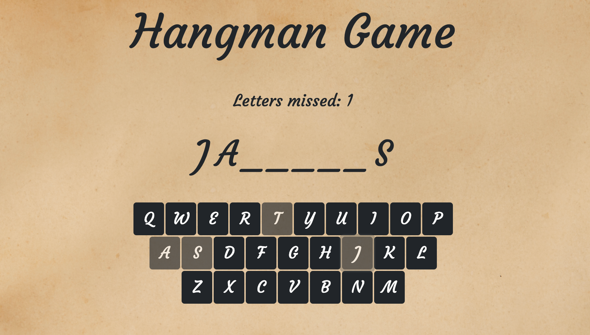

# Ulitmate List App


## Description 
This application is built with React on top of an Express.js server.  It is my take on the traditional hangman game. The words for the game are generated randomly through a third party API. The app utilizes many different elements of React such as hooks, state, and conditional rendering.        

#### Built With
* React.js
* Node.js
* Express.js
* Bootstrap 

## Table of Contents
  
* [Installation](#installation)
* [Usage](#usage)
* [Questions](#questions)
  
  
## Installation
### View the Project Live
https://hangman-react-app.herokuapp.com/

### Run the Project Locally
** This project requires node.js to run locally so make sure this is installed on your device.  **

* Step 1: Navigate to the directory you want to store the project. Clone this your repository to your local computer using the command below. 
```bash
git clone https://github.com/MarkMulligan97/readmeGenerator.git
```

* Step 2: Use the command line to navigate to the directory that you cloned the project.
Example:
```bash
cd directory/projectdirectory
```

* Step 3: Install the npm package dependencies from the package.json file.
```bash
npm install
```

* Step 4: Comment out the if statement on line 14 in the server.js file.  This will allow the client/build file to be loaded in developement environment.  
```javascript
//if (process.env.NODE_ENV === "production") {
    app.use(express.static("client/build"));
//}
```

* Step 5: Add a proxy to the package.json in the client folder so that the api can be used in the local environment.   
```javascript
"proxy": "http://localhost:8000"
```

* Step 6: While in the project directory, run the program using node using the command below. Open you browser and navigate to localhost:8000 to view the application.
```bash
node server.js
```  

## Usage 

1.  Select Start on the index page.
2.  Choose your difficulty level for the game (easy words are 3-6 letters, medium 7-9 letters, and hard is 10 or more letters in the word).
3.  Click a keyboard button on the screen to choose a letter.  You have 7 incorrect guess.  The goal is to guess all the letters in the word.  



## Questions
[My Github](https://github.com/MarkMulligan97) || mark.mulligan.jr1@gmail.com

#### How to Contact Me
Feel free to reach out to me if you have any questions about this project.  You can email me using the email listed above or can go to my github page to view my other projects and portfolio.

© Mark Mulligan 2021 All Rights Reserved.